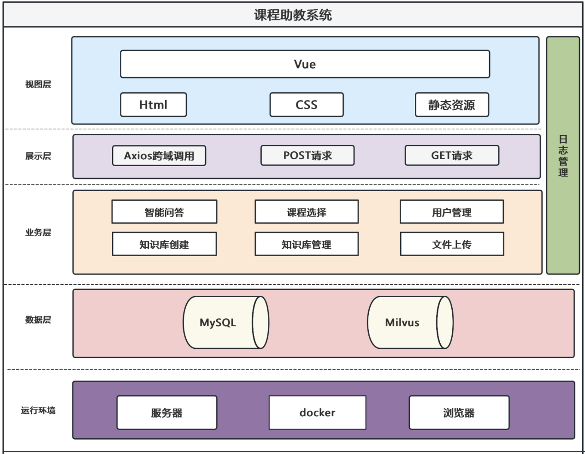
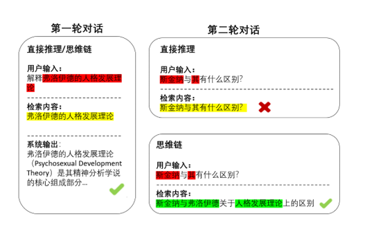

# 基于大模型的课程助教系统

本项目基于大模型，目标是为高校教学场景提供一个**可管理、可扩展的智能课程助教平台**。
系统以检索增强生成（RAG）为核心，将大语言模型与向量数据库结合，支持教师/管理员构建课程知识库并为学生提供多轮对话问答服务。
## 项目亮点

- 将向量数据库（Milvus）与大模型结合，使用非参数化知识存储避免频繁微调；
- 自动化文档解析（OCR）+ 贪心分块算法实现教学资料的结构化存储；
- 智能体（Agent）+ 思维链（CoT）用于多轮对话上下文理解与查询改写，提高召回与回答质量；
- 混合检索（稠密向量 + 稀疏检索）+ 结果融合（RRF）提升检索准确性。

## 思维链范例


## 功能清单

- 用户与权限管理（管理员 / 教师 / 学生）
  - 管理员可管理用户信息、创建与维护课程分区；
  - 教师可创建课程知识库、上传教学资料、修改知识库内容；
  - 学生可选择课程并与课程专属助教进行对话。

- 文件上传与知识库构建
  1. 支持 PDF / PPT 文件上传（单文件限制由部署时设置，论文示例为 100MB 上限）；
  2. 使用 OCR 提取文本与章节结构；
  3. 使用固定块大小的贪心分块算法对文本切分为若干知识块（chunk）；
  4. 对每个知识块调用文本嵌入模型生成向量（可选模型：BGE / SentenceTransformers 等）；
  5. 向量与元信息（原文出处、章节标题、原文片段）一起存入 Milvus 的指定分区。

- 检索与问答流程（RAG）
  1. 用户输入问题；智能 Agent 使用 CoT 对问题进行语义改写与意图识别；
  2. 将改写后的问题转为向量，使用混合检索（稠密检索 + 稀疏检索）从向量库召回候选知识块；
  3. 使用 RRF（Reciprocal Rank Fusion）对多路检索结果融合并排序，取 top-K 作为上下文证据；
  4. 将证据与原问题一起送入大模型生成最终回答，必要时 Agent 可引用来源并建议人工审校。

- 知识库维护
  - 支持在线修改与删除知识块（修改后同步更新向量数据库）；
  - 对修改进行敏感词审查与版本锁定以保障数据质量。

## 数据库表

- chunk（知识块表）
  - chunkSeqId : varchar(100)  # 主键
  - course_name : varchar      # 外键，指向课程分区
  - densevector : FloatVector
  - sparsevector : FloatVector
  - text : varchar
  - source_book : varchar
  - title : varchar

- course（课程表）
  - course_name : varchar(65535)  # 主键
  - partition_name : varchar(65535)

- users（用户表，示例）
  - id : int  # 主键
  - username : varchar
  - password : varchar (加密存储)
  - role : enum (admin / teacher / student)

(以上结构为论文中设计的简化版，实际实现可根据需求扩展字段与索引)

## 关键实现要点

- 文档解析：采用 OCR 自动抽取文本与章节元信息，结合正则/启发式规则识别章节结构；
- 分块策略：固定块大小的贪心算法按字符/句子边界优先切分，尽量保证知识块的语义完整性；
- 嵌入与向量存储：每个知识块同时生成稠密向量与稀疏向量以支持混合检索；
- 检索融合：使用 RRF 对不同 embedding 输出（不同模型/不同维度）融合排序；
- 智能体：基于 LangChain 风格的 Agent 管理多步骤决策（是否检索、是否调用外部工具、如何生成回答）；
- 前后端交互：前端 Vue 发起 RESTful API / Websocket 调用后端 Flask；对话记录与上下文在服务端短期保存以支持多轮对话。

## 部署与运行

1. 克隆仓库并进入目录：

   ```bash
   git clone https://github.com/your-username/AI-Assistant.git
   cd AI-Assistan
   ```

2. 准备后端环境（示例）

   - Python 3.10.x
   - 建议使用虚拟环境（venv / conda）
   - 安装依赖：pip install -r requirements.txt

3. 准备前端环境（示例）

   - Node.js + npm

     ```bash
     npm install
     npm run serve
     ```

4. 启动后端

   ```bash
   export FLASK_APP=app.py
   flask run --host=0.0.0.0 --port=5000
   ```

   （生产环境建议使用 Gunicorn + Nginx / Docker Compose 编排 Milvus、MySQL）

5. 配置向量数据库与嵌入模型

   - 启动 Milvus 集群（可通过 Docker Compose）；
   - 在配置文件中指定 Milvus 地址、嵌入模型类型与向量维度；
   - 若使用 GPU 加速，请确保驱动与 CUDA 配置正确。

## 常见 API

- POST /api/login_check —— 登录验证，接收 JSON：{"username":"xxx","password":"yyy"}
- POST /api/upload_file —— 上传课程 PDF/PPT 并触发 OCR + 分块 + 入库
- POST /api/create_course —— 创建课程分区
- POST /api/query —— 提交问题，返回智能回答（内部会触发检索与生成）
- POST /api/update_user —— 管理员更新用户信息
